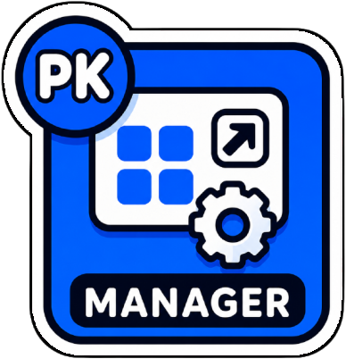
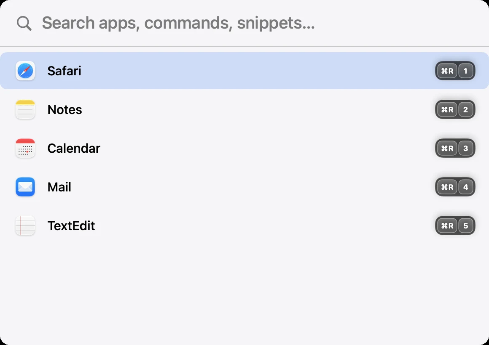
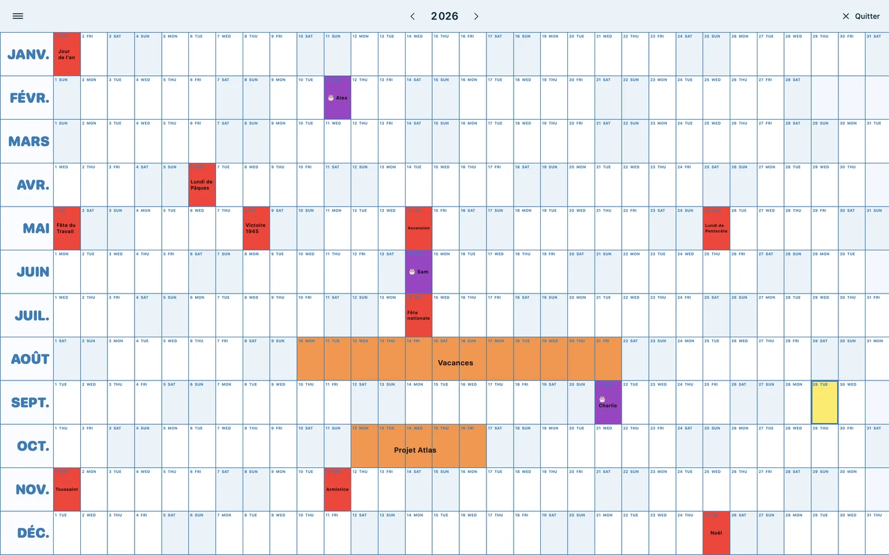

# PKwindowsManagement

[🇫🇷 FR](README.md) · [🇬🇧 EN](README_en.md)



PKwindowsManagement est une app macOS en barre de menu pour gérer les fenêtres au clavier et lancer rapidement les applications installées.

## Vitrine interactive

[Découvrir la vitrine](store/website/index.html) : présentation FR/EN, fonctionnalités détaillées, playground de fenêtres et aperçus des thèmes Big Year.




- [Démo vidéo](store/website/videos/window-flow.mp4) · [GIF animé](store/website/gifs/window-flow-wide.gif)
- [Télécharger le dernier Stable publié — v2026.10.49](https://github.com/mondary/PKwindowsManagement/releases/latest/download/PKwindowsManagement_2026.10.49.dmg) : montez le DMG, glissez l'app dans Applications et autorisez l'Accessibilité. Build Apple Silicon pour macOS 13+.
- Homebrew : `brew install --cask mondary/tap/pk-windows-management` (mise à jour : `brew upgrade --cask pk-windows-management`).
- curl : `curl -L -o PKwindowsManagement.dmg https://github.com/mondary/PKwindowsManagement/releases/latest/download/PKwindowsManagement_2026.10.49.dmg`
- [Sources et limites des captures](store/media-kit/README.md)

## ✅ Fonctionnalités
- Snap des fenêtres actives sur les moitiés, tiers, quarts et coins de l'écran.
- `Tout maximiser` : passe toutes les fenêtres visibles de tous les écrans en presque maximisé, raccourci par défaut `Ctrl + Option + G`.
- `Tout maximiser (app active)` : idem, limité aux fenêtres de l'application au premier plan, raccourci par défaut `Ctrl + Shift + D`.
- `Carreler toutes les fenêtres` : dispose les fenêtres visibles de l'app au premier plan en grille sur l'écran (4 → 2×2, 6 → 3×2…), raccourci par défaut `Ctrl + Option + T`.
- Déplacement de la fenêtre vers l'écran suivant ou précédent.
- Gestion expérimentale des bureaux macOS (Spaces) : création/fermeture, déplacement de la fenêtre active vers le bureau voisin et fond d’écran aléatoire optionnel depuis un dossier choisi.
- Ces commandes utilisent des API privées de macOS ; Mission Control peut apparaître brièvement et une mise à jour système peut nécessiter une adaptation.
- Raccourcis clavier configurables depuis une interface SwiftUI.
- Contrôle de la fenêtre focalisée via les API d'accessibilité macOS.
- Launchpad plein écran avec recherche, applications récentes et raccourcis personnalisés.
- Navigation du Launchpad au clavier : saisie pour filtrer, flèches pour sélectionner et `Entrée` pour lancer.
- Raccourcis globaux par application, actifs partout sur macOS même quand le Launchpad est fermé.
- Distinction gauche/droite pour les modificateurs : Command, Option et Shift (ex : Right Command + A ≠ Left Command + A).
- Support du modificateur `Fn + Shift` pour les raccourcis de lancement.
- Enregistrement des séquences clavier pour les raccourcis.
- Boutons dédiés pour les touches spéciales (Space, Return, Tab, Delete, flèches).
- Gestionnaire de snippets avec scripts exécutables et raccourcis globaux.
- Snippet `Archive` présent par défaut : range le Bureau dans une archive locale instantanée, utilise des dossiers mensuels en français (`2026_06_juin`), puis recopie vers Google Drive en arrière-plan, avec icône dédiée et raccourci `Right Cmd + S`.
- Snippet `DL2desk` présent par défaut : déplace le contenu de `Downloads` vers le Bureau, avec renommage automatique en cas de conflit et raccourci `Right Cmd + L`.
- Icône dossier pour les snippets Finder qui ouvrent `Applications`, `Home` ou `Documents`.
- Gestionnaire d'URLs avec choix du navigateur et raccourcis globaux.
- Tri configurable des applications du Launchpad par dernier lancement, nom, couleur dominante ou ordre personnalisé par glisser-déposer.
- Regroupement par catégories avec tri indépendant : catégories les plus fournies, ordre alphabétique ou ordre personnalisé par glisser-déposer ; les apps gardent leur propre critère de tri dans chaque catégorie.
- Le tri général choisi dans `Appearance` (dernier lancement, nom, couleur ou personnalisé) s'applique aussi quand le regroupement par catégorie est désactivé ; l'ordre des catégories ne concerne que l'affichage groupé.
- Paramétrage fin de la grille du Launchpad : colonnes, lignes, taille des icônes, espacement des colonnes et des lignes.
- Profils de grille par écran pour adapter le Launchpad à chaque moniteur connecté.
- Choix du mode de navigation du Launchpad : scroll vertical continu ou pages horizontales.
- Alignement en haut des pages en mode navigation horizontale.
- Vue `Big Year` plein écran sans scroll : thèmes Pastel, Catppuccin Latte/Mocha, Dracula ou Poster bleu (12 mois × 31 jours), week-ends, jours fériés français, vacances scolaires A/B/C, anniversaires avec `🎂` et événements personnalisés ; fermeture par bouton, `Échap` ou `Cmd + W`.
- Indicateur de statut d'accessibilité avec bouton pour autoriser l'accès.
- Export automatique des backups vers un dossier au choix (ex : Google Drive) à chaque modification des réglages.
- Menu contextuel sur chaque application pour attribuer un raccourci ou la déplacer vers la Corbeille.
- Commande `Empty Trash` dans le Launchpad pour vider la Corbeille via Finder.
- Ouverture du Launchpad avec `Option + Espace`, le coin supérieur gauche ou un clic sur l'icône de barre de menu.
- L'icône officielle de l'app s'affiche dans la barre de menu (en couleur) ; menu contextuel pour ouvrir les préférences ou quitter.
- Mises à jour Sparkle dans `À propos` : compare la version installée aux dernières versions Stable et Dev ; chaque canal indique s'il est à jour, propose une mise à jour ou correspond à l'autre canal.
- Chargement plus léger au démarrage : les raccourcis globaux n'ont plus besoin de charger toutes les icônes d'applications, et l'analyse couleur ne se fait que pour le tri `Icon Color`.

## 🧠 Utilisation
- Ouvre l'application.
- Autorise l'accès à l'accessibilité quand macOS le demande.
- Utilise les raccourcis par défaut pour déplacer la fenêtre active.
- Utilise `Option + Espace` pour afficher ou masquer le Launchpad.
- Dans le Launchpad, commence à saisir puis appuie sur `Entrée` pour lancer le premier résultat.
- Utilise les flèches pour changer de sélection.
- Utilise la molette ou le trackpad pour naviguer dans le Launchpad.
- Appuie sur `Échap` une fois pour vider une recherche, puis une seconde fois pour fermer le Launchpad.
- Clique sur `•••` en haut à droite pour ouvrir les réglages.
- Utilise `Right Cmd + L` pour déplacer les éléments de `Downloads` vers le Bureau avec `DL2desk`.
- Lance `Empty Trash` depuis le Launchpad pour vider la Corbeille. Au premier usage, macOS peut demander l'autorisation d'automatiser Finder.
- Utilise `Cmd + ,` pour ouvrir les réglages depuis l'application.

### Raccourcis par défaut
- `Ctrl + Option + H` : moitié gauche
- `Ctrl + Option + L` : moitié droite
- `Ctrl + Option + K` : moitié haute
- `Ctrl + Option + J` : moitié basse
- `Ctrl + Option + M` : maximiser
- `Ctrl + Option + C` : centrer
- `Ctrl + Option + U` : coin haut gauche
- `Ctrl + Option + I` : coin haut droit
- `Ctrl + Option + N` : coin bas gauche
- `Ctrl + Option + O` : coin bas droit
- `Ctrl + Option + 1` : tiers gauche
- `Ctrl + Option + 2` : tiers central
- `Ctrl + Option + 3` : tiers droit
- `Ctrl + Option + [` : écran précédent
- `Ctrl + Option + Space` : écran suivant
- `Ctrl + Option + =` : agrandir depuis le centre
- `Ctrl + Option + -` : réduire depuis le centre
- `Ctrl + Option + B` : créer un bureau
- `Ctrl + Option + W` : fermer le bureau actuel
- `Ctrl + Shift + →` / `←` : déplacer la fenêtre active vers le bureau virtuel (Space) suivant / précédent

## ⚙️ Réglages
- Les mises à jour intégrées attendent la restauration du Canvas et la fermeture effective de l’app avant son remplacement et son relancement. Si une ancienne Dev reste bloquée à cette étape, un redémarrage de l’app peut être nécessaire ; voir le [CHANGELOG](CHANGELOG.md).
- **Canvas horizontal** (canal Dev) : grille défilante de vraies fenêtres — 3×2 sur grand écran, 2×2 sur MacBook, ou **1 ligne par colonne** (colonnes pleine hauteur) au choix dans les réglages. `Ctrl+Shift+Espace` active/désactive, `Ctrl+Shift+H/L` colonne précédente/suivante, `⌥` + trackpad/molette fait glisser la grille. La sortie restaure la position et la taille exactes de chaque fenêtre ; une commande de snap (ex. quart haut-droite) quitte le Canvas et applique son placement. Moteur inspiré de Paneru (MIT, crédité) ; voir le [CHANGELOG](CHANGELOG.md).
- Dans `Raccourcis fenêtre` → `Bureaux`, affecte un raccourci à **Déplacer le bureau à gauche/droite** pour réordonner le bureau avec son contenu. Mission Control apparaît brièvement ; désactive le réagencement automatique des Spaces dans macOS pour conserver ton ordre. Glisser réel en cours de validation sur Dev.
- Les raccourcis sont modifiables dans l'écran de préférences.
- Dans `Raccourcis fenêtre` → `Bureaux`, configure la création, la fermeture et le déplacement entre Spaces. Tu peux choisir un dossier de fonds d’écran, activer la sélection aléatoire à la création et décider si l’app bascule vers le bureau de destination après un déplacement.
- Sur Dev, lorsque le suivi est activé, les déplacements successifs conservent la même fenêtre comme cible, même si macOS perturbe le focus. Un clic, `Cmd+Tab` ou une autre commande de fenêtre/application démarre une nouvelle sélection. Les raccourcis rapides sont exécutés dans l’ordre ; Mission Control impose toujours son temps de transition. Validation réelle du correctif en cours.
- La gestion des Spaces est expérimentale : elle s’appuie sur des API privées SkyLight et l’arbre d’accessibilité de Mission Control/WindowManager. La création et la fermeture, ainsi que le suivi après déplacement, peuvent brièvement afficher Mission Control ; une mise à jour majeure de macOS peut casser ces appels.
- Modificateurs disponibles : Control+Option, Command, Left/Right Command, Option, Left/Right Option, Shift, Left/Right Shift, Fn+Shift.
- Un clic droit sur une application permet d'attribuer ou modifier son raccourci global.
- Les raccourcis attribués apparaissent sur les icônes sous forme de touches.
- Enregistrement des raccourcis via un bouton `Record`.
- Les réglages s’ouvrent sur **Fenêtres**. Une **carte clavier** montre sur chaque touche sa position de fenêtre et son raccourci (`Y` quart haut-gauche, `U/I/O/J/K/L` sixièmes, `1/2/3` tiers, `P`/`H`/`M` quarts) ; elle suit tes raccourcis actuels. Les marges affichent **Haut, Bas, Gauche, Droite** ; le **Canvas horizontal (Open Canvas)** regroupe ses commandes et le choix d’une ou deux lignes par colonne.
- **Scripts** et **Liens web** sont deux rubriques distinctes, suivies de **Big Year**. **Système**, sous IA locale, regroupe langue, accessibilité et sauvegardes.
- **Launchpad** conserve le raccourci global, le coin actif et les applications. **Apparence** regroupe style, thème compact, organisation par catégorie, grille, tri et navigation.
- Ordre des applications du Launchpad configurable dans `Appearance` : `Last Used`, `Name`, `Icon Color` ou `Custom Order` (glisser-déposer dans le Launchpad).
- Dans `Apparence` → `Organisation`, active le regroupement par catégorie et choisis leur ordre : catégories les plus fournies, alphabétique ou personnalisé (glisser-déposer les pastilles dans le Launchpad).
- Paramétrage de la grille du Launchpad : nombre de colonnes/lignes, taille des icônes, espacement des colonnes et des lignes.
- Possibilité de définir une grille spécifique par écran dans les réglages d'apparence.
- Choix du mode de navigation du Launchpad : scroll vertical ou pages horizontales.
- Les changements sont sauvegardés dans `UserDefaults`.
- Dans `À propos`, choisis le canal de mise à jour `Stable` ou `Dev` et compare la version installée aux dernières versions publiées sur chaque canal. Le canal Dev installe les builds automatiquement ; Stable conserve la confirmation avant installation.
- La barre latérale garde la version installée et la version disponible sur une même ligne, sans déplacer les drapeaux ; clique sur la version proposée pour lancer l'installation. Les vérifications manuelles s'appuient sur l'appcast frais et l'archive signée du canal.
- Import/export manuel des réglages au format JSON.
- Auto-backup : choisis un dossier (ex : Google Drive) et exporte un backup JSON horodaté à chaque modification des réglages.
- Dans le calendrier ou sa section dédiée `Big Year` des réglages, utilise l’aperçu vivant, choisis la zone scolaire, le thème et l’apparence : anniversaires ou noms des mois en gras au choix (le `!` reste prioritaire), et couleurs personnalisées pour chaque élément (fond, jours fériés, anniversaires, événements, zones, texte…). Puis saisis un anniversaire par ligne au format `JJ.MM,Prénom` ou `JJMM,Prénom` (par exemple `11.02,Clément` ou `0112,Marie`). Préfixe le prénom par `!` pour un événement important en gras. Clique aussi directement sur une journée pour créer un événement d'un jour ou une plage, ou utilise le format texte `JJ.MM-JJ.MM,Titre`. Active `Calendriers macOS / Google` pour importer les événements journée entière des comptes configurés dans Calendrier macOS.

## 🧾 Commandes
- Clic gauche sur l'icône de barre de menu : ouvre ou ferme le Launchpad.
- Clic droit sur l'icône de barre de menu : affiche les actions Launchpad/Big Year, les raccourcis configurés, puis `Check for Updates`, `Open Preferences`, Ko-fi et `Quit`.
- `Open Big Year` : ouvre la vue annuelle plein écran. `Échap` ou `Cmd + W` la ferment, `Cmd + Q` quitte l'app.
- `Cmd + ,` : ouvre les réglages.

## 📦 Build & Package
- Prérequis : macOS 13 ou plus.
- Swift tools : 5.10.
- Build local :
```bash
swift build
```
- Création du bundle debug et lancement :
```bash
src/script/build_and_run.sh
```
- Création du bundle sans lancement :
```bash
src/script/package_app.sh debug
src/script/package_app.sh release
```
- Création d'une app testable sur le Bureau :
```bash
src/script/package_app.sh debug
rm -rf ~/Desktop/PKwindowsManagement.app
ditto build/PKwindowsManagement.app ~/Desktop/PKwindowsManagement.app
```
- Création d'une release et copie dans `/Applications` :
```bash
src/script/release.sh
```

## 🧪 Installation
- Lance `src/script/release.sh` pour compiler et installer `/Applications/PKwindowsManagement.app`.
- Garde l'app installée au même chemin (`/Applications/PKwindowsManagement.app`) et construis-la toujours avec `src/script/package_app.sh` ou `src/script/release.sh` pour conserver le même identifiant, la même signature et éviter que macOS redemande inutilement les autorisations.
- Au premier usage, valide l'accès à l'accessibilité dans `Réglages Système > Confidentialité et sécurité > Accessibilité`. Cette permission est nécessaire pour gérer les fenêtres et écouter les raccourcis globaux.
- Pour `Empty Trash`, valide aussi l'autorisation d'automatisation Finder quand macOS la demande. Cette commande passe par Finder car macOS bloque l'accès direct au dossier `~/.Trash`.
- Si l'app n'agit pas sur les fenêtres, vérifie aussi les permissions de l'app cible si nécessaire.

## 🙏 Crédits

PKwindowsManagement s'appuie sur des projets open source et s'en inspire — les crédits sont dans l'app, dans la section dédiée **Crédits & inspirations** :

- [Rooms](https://github.com/saragordic/rooms) (Sara Gordić, MIT) — concept des rooms et moteur de disposition porté en RoomTiler.
- [Sparkle 2](https://github.com/sparkle-project/Sparkle) (MIT) — mises à jour automatiques Stable/Dev.
- [Laya](https://huggingface.co/convaiinnovations/laya) (Convai Innovations, Apache-2.0) — modèle de décision local derrière l'IA intégrée.
- [Hammerspoon](https://github.com/Hammerspoon/hammerspoon) (MIT) — techniques d’accessibilité Mission Control et de gestion des Spaces.
- [yabai](https://github.com/asmvik/yabai) (MIT) — techniques de compatibilité SkyLight pour déplacer les fenêtres entre Spaces.

## 🧾 Changelog
- Voir [CHANGELOG.md](CHANGELOG.md) pour l'historique complet.

## 🔗 Liens
- EN README : [README_en.md](README_en.md)
- Changelog : [CHANGELOG.md](CHANGELOG.md)

## ❤️ Soutenir
Soutenir ce projet sur [Ko-fi](https://ko-fi.com/pouark).
