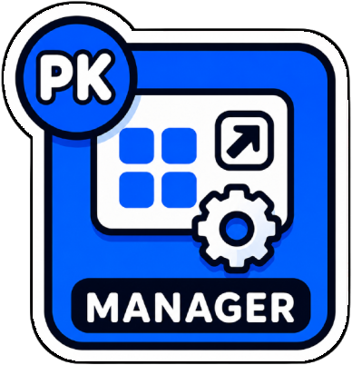

# PKwindowsManagement

[🇬🇧 EN](README_en.md) · [🇫🇷 FR](README.md)



PKwindowsManagement is a macOS menu bar app for keyboard-driven window management and fast application launching.

## ✅ Features
- Snap active windows to halves, thirds, quarters, and corners.
- `Maximize All Windows`: snaps every visible window on every display to almost-maximize, default shortcut `Ctrl + Option + G`.
- `Maximize All Windows (Current App)`: same, limited to the windows of the frontmost application, default shortcut `Ctrl + Shift + D`.
- Move a window to the next or previous display.
- Customize keyboard shortcuts from a SwiftUI preferences screen.
- Control the focused window through macOS Accessibility APIs.
- Full-screen Launchpad with search, recent applications, and custom shortcuts.
- Keyboard Launchpad navigation: type to filter, use arrows to select, and press `Enter` to launch.
- Global per-application shortcuts that work anywhere on macOS while Launchpad is closed.
- Left/right modifier key distinction: Command, Option, and Shift (e.g. Right Command + A ≠ Left Command + A).
- `Fn + Shift` modifier support for launch shortcuts.
- Direct keyboard sequence recording for shortcuts.
- Script snippets with global shortcuts and enable/disable support.
- Default `Archive` snippet: clears the Desktop into a fast local archive, uses deterministic French monthly folders (`2026_06_juin`), then mirrors it to Google Drive in the background, with a dedicated icon and a `Right Command + S` shortcut.
- URL snippets with browser selection and global shortcuts.
- Fine-grained Launchpad grid customization: columns, rows, icon size, column spacing, and row spacing.
- Per-display Launchpad grid profiles to adapt the layout to each connected monitor.
- Launchpad navigation mode: continuous vertical scroll or horizontal pages.
- Top-aligned pages in horizontal navigation mode.
- Scroll-free full-screen `Big Year`: Pastel, Catppuccin Latte/Mocha, Dracula, or Blue Poster (12 months × 31 days) themes, weekends, French public holidays, school holidays for zones A/B/C, birthdays marked with `🎂`, and custom events; close button, `Escape`, and `Cmd + W` exit paths.
- Accessibility status indicator with grant-access button.
- Automatic backup export to a user-chosen folder (e.g. Google Drive) on every settings change.
- Application context menu for assigning shortcuts or moving applications to Trash.
- Open Launchpad with `Option + Space`, the top-left hot corner, or a menu bar icon click.
- The app's official icon is shown in the menu bar (full color); context menu to open preferences or quit.
- Lighter startup path: global shortcuts no longer need to load every application icon, and dominant-color analysis only runs for the `Icon Color` sort mode.

## 🧠 Usage
- Launch the app.
- Grant Accessibility permission when macOS asks for it.
- Use the default shortcuts to manage the active window.
- Use `Option + Space` to show or hide Launchpad.
- In Launchpad, start typing and press `Enter` to launch the first result.
- Use arrow keys to change selection.
- Use the mouse wheel or trackpad to navigate in Launchpad.
- Press `Escape` once to clear a search, then again to close Launchpad.
- Click `•••` in the top-right corner to open settings.
- Use `Cmd + ,` to open settings from the app.

### Default shortcuts
- `Ctrl + Option + H` : left half
- `Ctrl + Option + L` : right half
- `Ctrl + Option + K` : top half
- `Ctrl + Option + J` : bottom half
- `Ctrl + Option + M` : maximize
- `Ctrl + Option + C` : center
- `Ctrl + Option + U` : top-left corner
- `Ctrl + Option + I` : top-right corner
- `Ctrl + Option + N` : bottom-left corner
- `Ctrl + Option + O` : bottom-right corner
- `Ctrl + Option + 1` : first third
- `Ctrl + Option + 2` : center third
- `Ctrl + Option + 3` : last third
- `Ctrl + Option + [` : previous display
- `Ctrl + Option + ]` : next display
- `Ctrl + Option + =` : enlarge from the center
- `Ctrl + Option + -` : shrink from the center

## ⚙️ Settings
- Shortcuts can be edited in the preferences window.
- Available modifiers: Control+Option, Command, Left/Right Command, Option, Left/Right Option, Shift, Left/Right Shift, Fn+Shift.
- Right-click an application to assign or edit its global shortcut.
- Assigned shortcuts appear as key badges over application icons.
- Shortcuts can also be captured with a `Record` button.
- `Scripts` and `URLs` are split into separate preferences sections.
- Launchpad grid customization: columns/rows count, icon size, column and row spacing.
- Per-display Launchpad grid profiles are available in Appearance settings.
- Launchpad navigation mode: vertical scroll or horizontal pages.
- Changes are persisted in `UserDefaults`.
- Manual settings import/export in JSON format.
- Auto-backup: choose a folder (e.g. Google Drive) and export a timestamped JSON backup on every settings change.
- In the calendar or its dedicated `Big Year` settings section, use the live preview, choose the school zone, theme, and appearance: birthdays or month names in bold as you prefer (the `!` marker still wins), plus custom colors for each element (background, holidays, birthdays, events, zones, text…). Then enter one birthday per line as `DD.MM,Name` or `DDMM,Name` (for example `11.02,Clément` or `0112,Marie`). Prefix the name with `!` to emphasize it in bold. Click a day directly to create a single-day or date-range event, or use the `DD.MM-DD.MM,Title` text format. Enable `macOS / Google Calendars` to import all-day events from accounts configured in macOS Calendar.

## 🧾 Commands
- Left-click the menu bar icon to open or close Launchpad.
- Right-click the menu bar icon to show `Open Launchpad`, `Open Big Year`, `Open Preferences`, and `Quit`.
- `Open Big Year`: opens the full-screen year view. `Escape` or `Cmd + W` closes it, `Cmd + Q` quits the app.
- `Cmd + ,`: open settings.

## 📦 Build & Package
- Requirements: macOS 13 or later.
- Swift tools: 5.10.
- Local build:
```bash
swift build
```
- Build the debug app bundle and launch it:
```bash
src/script/build_and_run.sh
```
- Build an app bundle without launching:
```bash
src/script/package_app.sh debug
src/script/package_app.sh release
```
- Build a testable app on the Desktop:
```bash
src/script/package_app.sh debug
cp -R release/PKwindowsManagement.app ~/Desktop/PKwindowsManagement.app
```
- Build a release and copy it to `/Applications`:
```bash
src/script/release.sh
```

## 🧪 Install
- Run `src/script/release.sh` to build and install `/Applications/PKwindowsManagement.app`.
- On first launch, grant Accessibility access in `System Settings > Privacy & Security > Accessibility`. This permission is required for window management and global shortcuts.
- If the app cannot control windows, check the target app permissions as well.

## 🧾 Changelog
- See [CHANGELOG.md](CHANGELOG.md) for full history.

## 🔗 Links
- FR README: [README.md](README.md)
- Changelog: [CHANGELOG.md](CHANGELOG.md)
