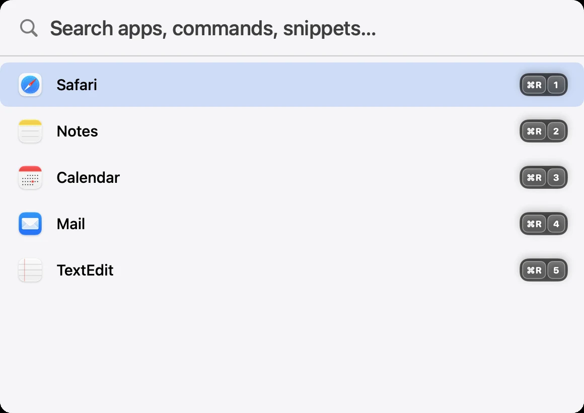

# PKwindowsManagement

[🇬🇧 EN](README_en.md) · [🇫🇷 FR](README.md)


PKwindowsManagement is a macOS menu bar app for keyboard-driven window management and fast application launching.

## Interactive website

[Discover the website](store/website/index.html): FR/EN presentation, detailed features, a window playground and Big Year theme previews.




- [Video demo](store/website/videos/window-flow.mp4) · [Animated GIF](store/website/gifs/window-flow-wide.gif)
- [Download the latest published Stable — v2026.10.49](https://github.com/mondary/PKwindowsManagement/releases/latest/download/PKwindowsManagement_2026.10.49.dmg): open the DMG, move the app to Applications and enable Accessibility. Apple Silicon build for macOS 13+.
- Homebrew: `brew install --cask mondary/tap/pk-windows-management` (upgrade: `brew upgrade --cask pk-windows-management`).
- curl: `curl -L -o PKwindowsManagement.dmg https://github.com/mondary/PKwindowsManagement/releases/latest/download/PKwindowsManagement_2026.10.49.dmg`
- [Capture sources and limitations](store/media-kit/README.md)

## ✅ Features
- Snap active windows to halves, thirds, quarters, and corners.
- `Maximize All Windows`: snaps every visible window on every display to almost-maximize, default shortcut `Ctrl + Option + G`.
- `Maximize All Windows (Current App)`: same, limited to the windows of the frontmost application, default shortcut `Ctrl + Shift + D`.
- `Tile All Windows`: lays out the visible windows of the frontmost app in a screen-filling grid (4 → 2×2, 6 → 3×2…), default shortcut `Ctrl + Option + T`.
- Move a window to the next or previous display.
- Experimental macOS desktop (Space) controls: create/close desktops, move the active window to an adjacent desktop, and optionally assign a random wallpaper from a chosen folder.
- These commands use private macOS APIs; Mission Control may briefly appear, and a system update may require adjustments.
- Customize keyboard shortcuts from a SwiftUI preferences screen.
- Control the focused window through macOS Accessibility APIs.
- Full-screen Launchpad with search, recent applications, and custom shortcuts.
- Sort Launchpad apps by last launch, name, dominant icon color, or a custom drag-and-drop order.
- Group apps into categories and sort categories independently by app count, alphabetically, or with a custom drag-and-drop order; the app sort mode still applies inside each category.
- The global app sort selected in `Appearance` (last launch, name, icon color, or custom) also applies when category grouping is disabled; category order only affects grouped display.
- Keyboard Launchpad navigation: type to filter, use arrows to select, and press `Enter` to launch.
- Global per-application shortcuts that work anywhere on macOS while Launchpad is closed.
- Left/right modifier key distinction: Command, Option, and Shift (e.g. Right Command + A ≠ Left Command + A).
- `Fn + Shift` modifier support for launch shortcuts.
- Direct keyboard sequence recording for shortcuts.
- Script snippets with global shortcuts and enable/disable support.
- Default `Archive` snippet: clears the Desktop into a fast local archive, uses deterministic French monthly folders (`2026_06_juin`), then mirrors it to Google Drive in the background, with a dedicated icon and a `Right Command + S` shortcut.
- URL snippets with browser selection and global shortcuts.
- Fine-grained Launchpad grid customization: columns, rows, icon size, column spacing, and row spacing.
- Per-display Launchpad grid profiles to adapt the layout to each connected monitor.
- Launchpad navigation mode: continuous vertical scroll or horizontal pages.
- Top-aligned pages in horizontal navigation mode.
- Scroll-free full-screen `Big Year`: Pastel, Catppuccin Latte/Mocha, Dracula, or Blue Poster (12 months × 31 days) themes, weekends, French public holidays, school holidays for zones A/B/C, birthdays marked with `🎂`, and custom events; close button, `Escape`, and `Cmd + W` exit paths.
- Accessibility status indicator with grant-access button.
- Automatic backup export to a user-chosen folder (e.g. Google Drive) on every settings change.
- Application context menu for assigning shortcuts or moving applications to Trash.
- Open Launchpad with `Option + Space`, the top-left hot corner, or a menu bar icon click.
- The app's official icon is shown in the menu bar (full color); context menu to open preferences or quit.
- Sparkle updates in `About`: compare the installed version with the latest Stable and Dev releases; each channel shows whether it is up to date, has an update, or is the other channel.
- Lighter startup path: global shortcuts no longer need to load every application icon, and dominant-color analysis only runs for the `Icon Color` sort mode.

## 🧠 Usage
- Launch the app.
- Grant Accessibility permission when macOS asks for it.
- Use the default shortcuts to manage the active window.
- Use `Option + Space` to show or hide Launchpad.
- In Launchpad, start typing and press `Enter` to launch the first result.
- Use arrow keys to change selection.
- Use the mouse wheel or trackpad to navigate in Launchpad.
- Press `Escape` once to clear a search, then again to close Launchpad.
- Click `•••` in the top-right corner to open settings.
- Use `Cmd + ,` to open settings from the app.

### Default shortcuts
- `Ctrl + Option + H` : left half
- `Ctrl + Option + L` : right half
- `Ctrl + Option + K` : top half
- `Ctrl + Option + J` : bottom half
- `Ctrl + Option + M` : maximize
- `Ctrl + Option + C` : center
- `Ctrl + Option + U` : top-left corner
- `Ctrl + Option + I` : top-right corner
- `Ctrl + Option + N` : bottom-left corner
- `Ctrl + Option + O` : bottom-right corner
- `Ctrl + Option + 1` : first third
- `Ctrl + Option + 2` : center third
- `Ctrl + Option + 3` : last third
- `Ctrl + Option + [` : previous display
- `Ctrl + Option + Space` : next display
- `Ctrl + Option + =` : enlarge from the center
- `Ctrl + Option + -` : shrink from the center
- `Ctrl + Option + B` : create a desktop
- `Ctrl + Option + W` : close the current desktop
- `Ctrl + Shift + →` / `←` : move the active window to the next / previous virtual desktop (Space)

## ⚙️ Settings
- In-app updates wait for Canvas restoration and actual application exit before replacing and relaunching the app. If an older Dev build stalls at this step, restarting the app may be necessary; see the [CHANGELOG](CHANGELOG.md).
- **Horizontal Canvas** (Dev channel) in `Window Shortcuts`: a scrolling grid of real windows — 3×2 on wide screens, 2×2 on MacBooks, or **one row per column** (full-height columns) as a setting. `Ctrl+Shift+Space` toggles, `Ctrl+Shift+H/L` moves column by column, `⌥` + trackpad/wheel slides the grid. Exiting restores every window's exact position and size; a snap command (e.g. top-right quarter) leaves the Canvas and applies its placement. Engine modeled after Paneru (MIT, credited); see the [CHANGELOG](CHANGELOG.md).
- In `Window Shortcuts` → `Desktops`, bind **Move Desktop Left/Right** to reorder the desktop with its contents. Mission Control appears briefly; disable automatic Spaces rearrangement in macOS to keep your order. Actual thumbnail dragging is being validated on Dev.
- Shortcuts can be edited in the preferences window.
- In `Window Shortcuts` → `Desktops`, configure create, close, and move-between-Space actions. Choose a wallpaper folder, enable random selection for new desktops, and decide whether to switch to the destination desktop after moving a window.
- On Dev, with follow enabled, consecutive moves retain the same target window even when macOS disrupts focus. A click, `Cmd+Tab`, or another window/app command starts a new selection. Rapid shortcuts run in order; Mission Control still needs time for each transition. Real-world validation of this fix is pending.
- Spaces management is experimental: it relies on private SkyLight APIs and the Mission Control/WindowManager accessibility tree. Creating or closing desktops, and following a moved window, may briefly show Mission Control; a major macOS update may break these calls.
- Available modifiers: Control+Option, Command, Left/Right Command, Option, Left/Right Option, Shift, Left/Right Shift, Fn+Shift.
- Right-click an application to assign or edit its global shortcut.
- Assigned shortcuts appear as key badges over application icons.
- Shortcuts can also be captured with a `Record` button.
- `Scripts` and `URLs` are split into separate preferences sections.
- In `Appearance`, sort Launchpad apps by `Last Used`, `Name`, `Icon Color`, or `Custom Order` (drag tiles in Launchpad).
- In `Launchpad` → `Organization`, enable category grouping and sort categories by app count, alphabetically, or custom order (drag category chips in Launchpad).
- Launchpad grid customization: columns/rows count, icon size, column and row spacing.
- Per-display Launchpad grid profiles are available in Appearance settings.
- Launchpad navigation mode: vertical scroll or horizontal pages.
- Changes are persisted in `UserDefaults`.
- In `General` or `About`, choose the `Stable` or `Dev` update channel and compare the installed version with the latest release on each channel. Dev builds install automatically; Stable asks before installing.
- The sidebar keeps the installed and available versions on one line without moving the language flags; click the offered version to install it. Manual checks use the fresh appcast and the channel's signed archive.
- Manual settings import/export in JSON format.
- Auto-backup: choose a folder (e.g. Google Drive) and export a timestamped JSON backup on every settings change.
- In the calendar or its dedicated `Big Year` settings section, use the live preview, choose the school zone, theme, and appearance: birthdays or month names in bold as you prefer (the `!` marker still wins), plus custom colors for each element (background, holidays, birthdays, events, zones, text…). Then enter one birthday per line as `DD.MM,Name` or `DDMM,Name` (for example `11.02,Clément` or `0112,Marie`). Prefix the name with `!` to emphasize it in bold. Click a day directly to create a single-day or date-range event, or use the `DD.MM-DD.MM,Title` text format. Enable `macOS / Google Calendars` to import all-day events from accounts configured in macOS Calendar.

## 🧾 Commands
- Left-click the menu bar icon to open or close Launchpad.
- Right-click the menu bar icon for Launchpad/Big Year actions and shortcuts, followed by `Check for Updates`, `Open Preferences`, Ko-fi, and `Quit`.
- `Open Big Year`: opens the full-screen year view. `Escape` or `Cmd + W` closes it, `Cmd + Q` quits the app.
- `Cmd + ,`: open settings.

## 📦 Build & Package
- Requirements: macOS 13 or later.
- Swift tools: 5.10.
- Local build:
```bash
swift build
```
- Build the debug app bundle and launch it:
```bash
src/script/build_and_run.sh
```
- Build an app bundle without launching:
```bash
src/script/package_app.sh debug
src/script/package_app.sh release
```
- Build a testable app on the Desktop:
```bash
src/script/package_app.sh debug
cp -R build/PKwindowsManagement.app ~/Desktop/PKwindowsManagement.app
```
- Build a release and copy it to `/Applications`:
```bash
src/script/release.sh
```

## 🧪 Install
- Run `src/script/release.sh` to build and install `/Applications/PKwindowsManagement.app`.
- On first launch, grant Accessibility access in `System Settings > Privacy & Security > Accessibility`. This permission is required for window management and global shortcuts.
- If the app cannot control windows, check the target app permissions as well.

## 🙏 Credits

PKwindowsManagement builds on and draws inspiration from open-source projects — credits live in the dedicated **Credits & Inspirations** settings section:

- [Rooms](https://github.com/saragordic/rooms) (Sara Gordić, MIT) — rooms concept and layout engine ported as RoomTiler.
- [Sparkle 2](https://github.com/sparkle-project/Sparkle) (MIT) — Stable/Dev auto-updates.
- [Laya](https://huggingface.co/convaiinnovations/laya) (Convai Innovations, Apache-2.0) — local decision model behind the integrated AI.
- [Hammerspoon](https://github.com/Hammerspoon/hammerspoon) (MIT) — Mission Control accessibility and Space-management techniques.
- [yabai](https://github.com/asmvik/yabai) (MIT) — SkyLight compatibility techniques for moving windows between Spaces.

## 🧾 Changelog
- See [CHANGELOG.md](CHANGELOG.md) for full history.

## 🔗 Links
- FR README: [README.md](README.md)
- Changelog: [CHANGELOG.md](CHANGELOG.md)

## ❤️ Support
Support this project on [Ko-fi](https://ko-fi.com/pouark).
